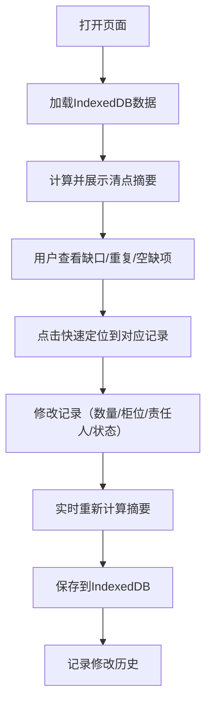

## 1. 产品概述
雨具柜清点管理工具是一个面向物业、园区、企业等场所的雨具管理客户端工具，用于高效清点雨具柜物品、实时监控库存缺口、明确管理责任人。本工具纯前端运行，数据本地化存储于IndexedDB，无需后端服务支持。

- 核心价值：解决雨具管理混乱、缺口发现不及时、责任不清的问题
- 目标用户：物业管理人员、后勤行政人员、仓库管理员

## 2. 核心功能

### 2.1 用户角色
| 角色 | 注册方式 | 核心权限 |
|------|----------|----------|
| 管理员 | 本地使用无需注册 | 全部功能：增删改查、批量操作、数据导入导出 |

### 2.2 功能模块
1. **清点摘要面板**：缺口条目、重复柜位、责任人空缺、最近修改记录快速定位
2. **雨具记录管理**：单条记录的增删改查，支持复制上一条、快速补齐连续柜位
3. **多维度筛选**：按柜位、责任人、状态、缺口情况筛选记录
4. **批量操作**：批量修改状态、批量删除
5. **实时联动**：数量变化触发缺口提示、柜位调整触发重复检查、责任人变更触发汇总更新
6. **数据持久化**：IndexedDB本地存储，支持数据导入导出

### 2.3 页面详情
| 页面名称 | 模块名称 | 功能描述 |
|-----------|-------------|---------------------|
| 主页面 | 清点摘要区域 | 集中展示缺口条目数、重复柜位列表、责任人空缺项、最近修改10条记录，点击可快速定位 |
| 主页面 | 筛选栏 | 柜位搜索框、责任人下拉、状态多选、缺口筛选开关 |
| 主页面 | 批量操作栏 | 全选/取消、批量改状态、批量删除按钮 |
| 主页面 | 记录列表 | 表格形式展示所有雨具记录，每行可编辑 |
| 主页面 | 快捷操作栏 | 新增记录、复制上一条、快速补齐连续柜位、导入、导出 |

## 3. 核心流程
用户打开工具后，首先查看清点摘要区域了解整体情况，点击问题项快速定位到具体记录；然后可以通过筛选条件缩小范围，对记录进行修改或批量操作；所有修改实时联动更新摘要面板的数据。

## 4. 用户界面设计

### 4.1 设计风格
- **设计调性**：专业严谨的工具类风格，采用深色主题搭配青色系主色调，营造高效、可靠的使用体验
- **主色**：青色 `#0ea5e9`（表示正常/可使用）
- **辅助色**：橙色 `#f97316`（待补充/警告）、蓝色 `#3b82f6`（待清洁/信息）、灰色 `#6b7280`（暂不开放）、红色 `#ef4444`（缺口/危险）
- **字体**：使用 Inter 作为主要字体，等宽字体用于柜位编号
- **布局**：顶部摘要面板 + 中部筛选操作栏 + 底部数据表格的三段式布局
- **交互**：实时校验、即时反馈、过渡动画流畅

### 4.2 页面设计概述
| 页面名称 | 模块名称 | UI Elements |
|-----------|-------------|-------------|
| 主页面 | 清点摘要区域 | 4个统计卡片并排，带图标和数字，缺口和重复项高亮显示，hover有详情预览 |
| 主页面 | 筛选栏 | 圆角输入框和下拉选择器，标签左对齐，筛选条件实时生效 |
| 主页面 | 记录列表 | 斑马纹表格，可编辑单元格，状态标签带颜色圆点，缺口行红色背景标记 |
| 主页面 | 快捷操作栏 | 图标按钮组，鼠标悬停显示tooltip，重要操作带确认对话框 |

### 4.3 响应性
- 桌面端优先设计，最小支持 1280px 宽度
- 表格区域支持横向滚动，适配小屏幕
- 触摸设备优化：按钮最小高度 40px，输入框足够大便于操作

### 4.4 动画与微交互
- 摘要数字变化时使用数字滚动动画
- 记录新增/删除时有淡入淡出过渡
- 状态切换时标签颜色有渐变过渡
- 批量操作时显示进度条
