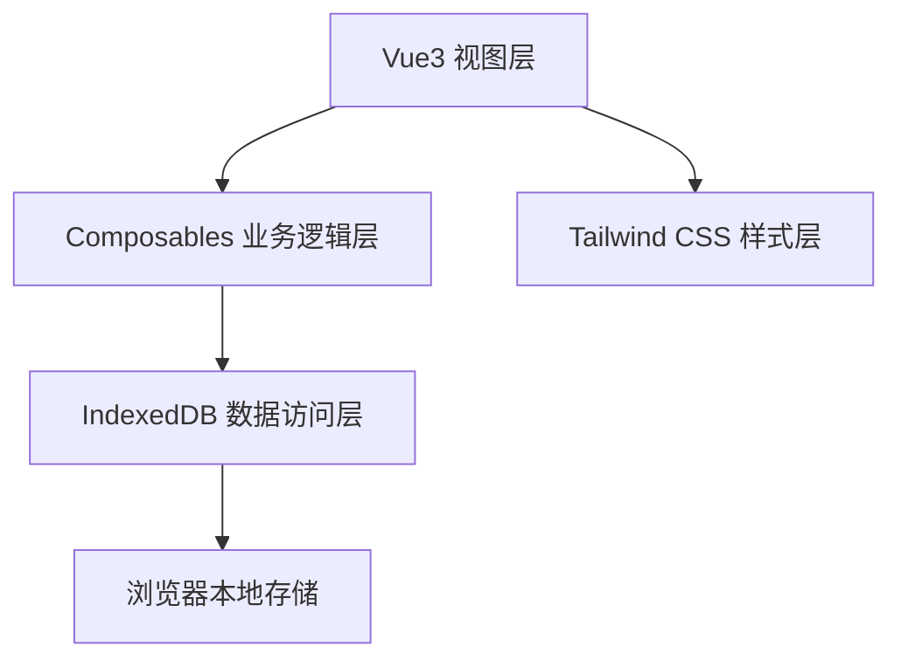
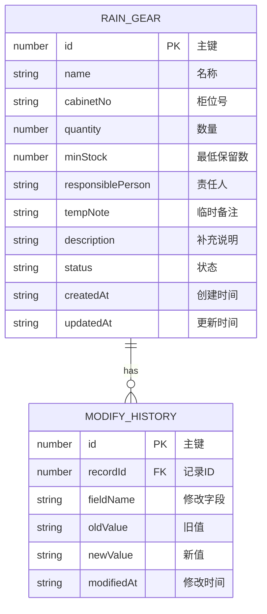

## 1. 架构设计


## 2. 技术描述
- 前端框架：Vue 3.4 + TypeScript 5.4 + Vite 5.2
- 样式方案：Tailwind CSS 3.4
- 状态管理：Vue Composition API (ref/reactive/computed)
- 数据存储：IndexedDB (idb 库封装)
- 图标库：Lucide Vue
- 初始化工具：vite-init vue-ts 模板

## 3. 目录结构
```
src/
├── composables/
│   ├── useRainGearStore.ts      # 雨具数据状态管理
│   ├── useIndexedDB.ts          # IndexedDB 封装
│   └── useSummary.ts            # 摘要计算逻辑
├── components/
│   ├── SummaryPanel.vue         # 清点摘要面板
│   ├── FilterBar.vue            # 筛选栏
│   ├── BatchActionBar.vue       # 批量操作栏
│   ├── RainGearTable.vue        # 雨具记录表格
│   ├── RainGearRow.vue          # 单条记录行
│   └── QuickActions.vue         # 快捷操作栏
├── types/
│   └── index.ts                 # TypeScript 类型定义
├── utils/
│   └── helpers.ts               # 工具函数
├── App.vue                      # 根组件
├── main.ts                      # 入口文件
└── style.css                    # 全局样式
```

## 4. 数据模型

### 4.1 数据实体关系


### 4.2 类型定义
```typescript
type RainGearStatus = 'available' | 'needRefill' | 'needClean' | 'closed';

interface RainGear {
  id: number;
  name: string;
  cabinetNo: string;
  quantity: number;
  minStock: number;
  responsiblePerson: string;
  tempNote: string;
  description: string;
  status: RainGearStatus;
  createdAt: string;
  updatedAt: string;
}

interface ModifyHistory {
  id: number;
  recordId: number;
  fieldName: string;
  oldValue: string;
  newValue: string;
  modifiedAt: string;
}

interface SummaryData {
  gapItems: RainGear[];
  duplicateCabinets: string[];
  emptyResponsible: RainGear[];
  recentHistory: ModifyHistory[];
}
```

### 4.3 IndexedDB 配置
- 数据库名：`rain_gear_db`
- 版本号：`1`
- 对象仓库：
  - `rain_gears`：主键 `id` 自增，索引：`cabinetNo`, `responsiblePerson`, `status`
  - `modify_history`：主键 `id` 自增，索引：`recordId`, `modifiedAt`

## 5. 核心联动逻辑

### 5.1 缺口检测联动
```typescript
// 数量变化 → 重新计算缺口状态
watch(
  () => items.value,
  (items) => {
    items.forEach(item => {
      const isGap = item.quantity < item.minStock;
      if (isGap && item.status === 'available') {
        item.status = 'needRefill';
      }
    });
  },
  { deep: true }
);
```

### 5.2 重复柜位检测
```typescript
// 柜位变化 → 检测重复
const duplicateCabinets = computed(() => {
  const map = new Map<string, number[]>();
  items.value.forEach(item => {
    if (!map.has(item.cabinetNo)) {
      map.set(item.cabinetNo, []);
    }
    map.get(item.cabinetNo)!.push(item.id);
  });
  return Array.from(map.entries())
    .filter(([, ids]) => ids.length > 1)
    .map(([cabinetNo]) => cabinetNo);
});
```

### 5.3 责任人汇总
```typescript
// 责任人变化 → 更新顶部汇总
const responsibleStats = computed(() => {
  const stats = new Map<string, { total: number; gap: number }>();
  items.value.forEach(item => {
    if (!item.responsiblePerson) return;
    if (!stats.has(item.responsiblePerson)) {
      stats.set(item.responsiblePerson, { total: 0, gap: 0 });
    }
    const s = stats.get(item.responsiblePerson)!;
    s.total++;
    if (item.quantity < item.minStock) s.gap++;
  });
  return stats;
});
```

## 6. 业务规则
1. **缺口判定**：数量 < 最低保留数 且 状态非"暂不开放"
2. **重复柜位**：柜位号非空且存在多条记录使用同一柜位
3. **责任人空缺**：责任人字段为空
4. **状态流转**：
   - 数量达标 → 可手动改为"可使用"
   - 数量不足 → 可手动改为"待补充"
   - 需要清洁 → 可手动改为"待清洁"
   - 柜位停用 → 可手动改为"暂不开放"
5. **修改历史**：每次修改记录字段时，自动记录修改前后值和时间
